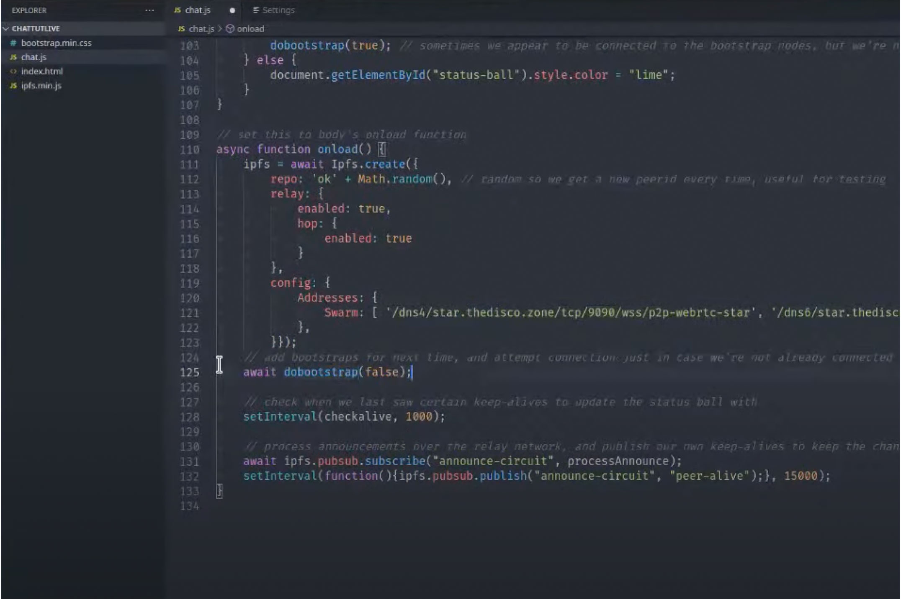

_From HackFS: Ryan Baumann from IPFS walks through the basics of browser integration using IPFS. This talk was delivered at HackFS, a three-week virtual hackathon dedicated to building a censorship-free decentralized internet. The complete discussion is_ [_available here_](https://www.youtube.com/watch?v=xZiN9dLvMoU&list=PLXzKMXK2aHh5iq_crvYF76EmPsZgcgLki&index=3)_._

The future of the internet is the decentralized web, but getting there requires infrastructure. At the heart of this infrastructure is IPFS, the InterPlanetary File System. Together with its name resolution system INFS (Interplanetary Name System), it presents a new way to hold and distribute content to browsers known as [content addressing](https://blog.ipfs.io/2021-06-03-ipfs-filecoin-content-persistence/).

Under this paradigm, data can be retrieved from wherever it is stored across the IPFS network based on its unique content ID (CID). This improves over the current location-based infrastructure where data is retrieved from specific servers and can be vulnerable to all kinds of security risks.

What this means for the average app developer is that instead of hosting an app and its requisite data on a centralized server, they can now upload their app to IPFS and run it directly from a decentralized storage network. This post takes a look at developing web browser interconnectivity through IPFS by putting together a very basic chat interface.

@[youtube](xZiN9dLvMoU)

The best way to stay up to date with this browser connectivity guide for a simple chat interface is in the IPFS [documentation](https://docs.ipfs.io/how-to/create-simple-chat-app/).

## Getting Started

This tutorial isn't advanced, and most developers will be familiar with what’s going on. The only difference is that this guide uses IPFS for the backend to connect to or discover other clients and chat with them.

Most web developers will already have a text editor of choice installed. The core elements for this tutorial can be accessed[ here](https://workshop.thedisco.zone/) and a completed demo can be accessed [here](https://github.com/TheDiscordian/browser-ipfs-chat).

This guide will focus on the chat.js file as what will be edited. To this end, the user should have the index.html opened in a browser to check on their progress during the tutorial.

If you want more detailed info about the connection, you can open the browser console and drop in the command await ipfs.id() to get it.

    await ipfs.id()