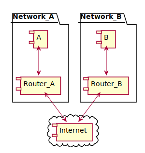
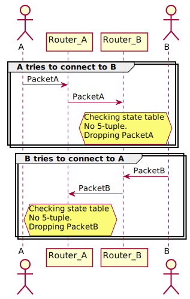
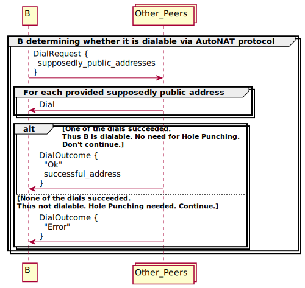
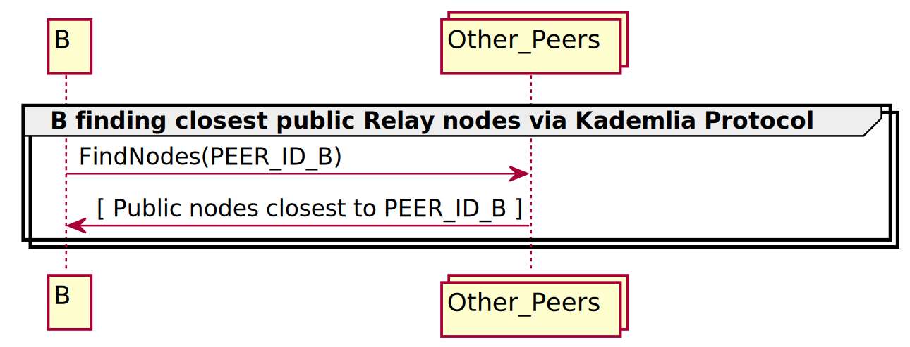
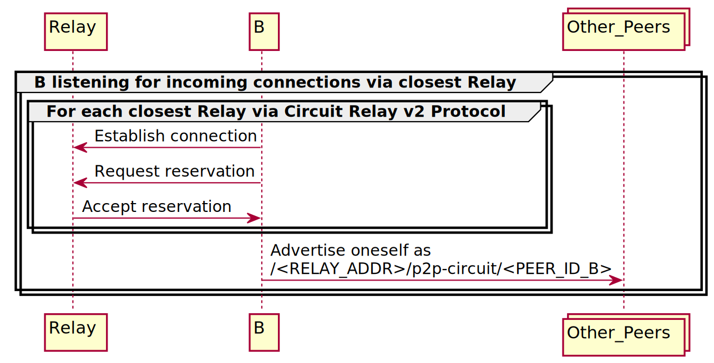
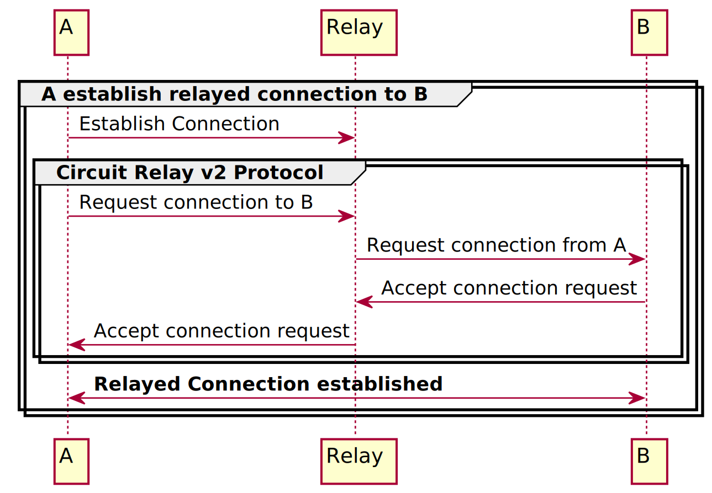
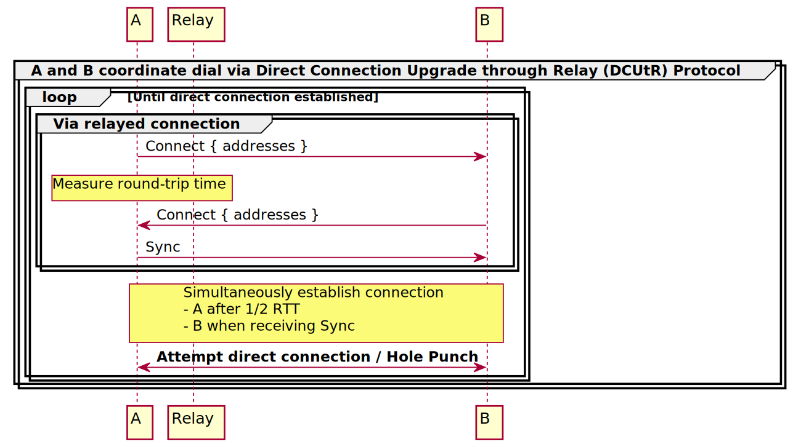

---
tags:
- libp2p
title: Hole punching in libp2p - Overcoming Firewalls
description: 
date: 2022-01-20
permalink: "/2022-01-20-libp2p-hole-punching/"
translationKey: ''
header_image:
author: Max Inden
---

In case you haven't yet heard the great news, [libp2p](https://docs.ipfs.io/concepts/glossary/#libp2p) can now punch holes.

The below explains why we want to punch holes, into what we are punching those holes and most interestingly how we punch those holes.

# The Problem with Firewalls

Computers in today's Internet can be divided into two groups, public and non-public computers, i.e. those that you can dial and those that you can not. Public computers can dial public computers. Non-public computers can dial public computers. But public computers cannot dial non-public computers, nor can non-public computers dial other non-public computers.

Note that we are focusing on overcoming firewalls today and ignore [NATs](https://docs.ipfs.io/concepts/glossary#nat) for now. The process described in this blog post (hole punching in libp2p) enables overcoming both. For the sake of simplicity this post focuses on firewalls and won't talk about NAT. In addition it assumes worst case scenario where neither of two peers is able to leverage [UPnP](https://en.wikipedia.org/wiki/Universal_Plug_and_Play) or set up manual port forwarding.

(We will be using the term "computer" and "node" as synonyms from now on.)

## Firewalls in a nutshell

Firewalls control the bytes flowing in and out of a network. They usually do so using a state table of 5-tuples. A 5-tuple is used to identify a connection between two endpoints. It consists of the IP source address, the IP destination address, the transport protocol e.g. TCP or UDP, the source port number and the destination port number of a connection. On TCP a firewall can determine the lifetime of these 5-tuples based on the TCP connection state (e.g. through `SYN` and `FIN`). On UDP, given that the protocol itself is connectionless, firewalls usually use timeouts to garbage collect the 5-tuple entries in the state table.

| Source IP   | Destination IP | Transport Protocol | Source Port | Destination Port |
|-------------|----------------|--------------------|-------------|------------------|
| 192.168.0.2 | 198.51.100.0   | TCP                | 12345       | 443              |
| 192.168.0.2 | 198.51.100.1   | UDP                | 12345       | 53               |
| ...         | ...            | ...                | ...         | ...              |

The simplest security measure all major consumer firewalls enforce to protect their network is the following:

1.  When forwarding an outgoing packet, add a 5-tuple for said connection to the state table.
2.  When receiving an incoming packet, check whether there is a 5-tuple for an outgoing connection matching the incoming packet.
    1.  If there is, it is a response to a previous outgoing packet and thus the packet is forwarded to the destined machine within the network.
    2.  If there is not, drop the packet.

## An example

Let's look at an example. Two computers, *A* and *B*, each in their own network, connected to the internet via a separate home router each, with those home routers acting as firewalls.

The sequence diagram below depicts the scenario where computer *A* emitts a packet destined for *B*. Said packet is first send to *A*'s router, which in turn forwards it to *B*'s router.

*A*'s router forwards the packet to *B*'s router. *B*'s router checks its state table, can not find a matching 5-tuple (IPA, IPB, TCP, PortA, PortB) and thus drops the packet. In a nutshell, this is why the Internet is divided into two, public and non-public computers.

Same applies to packets send from *B* to *A*, see second half of the sequence diagram.

Now this should not suggest to go ahead and disable all firewalls across the world. Please no. They do serve their purpose. Afterall *A* and *B* most likely don't want random strangers connecting to them. Though they do still want to connect to each other.

# Hole Punching

Hole punching is one mechanism to overcome the problem described above. Let's see how it works.

Imagine that we have some mysterious mechanism to synchronize *A* and *B*. Mysterious as synchronizing clocks is hard, &#x2026; really hard. For those that don't believe me, I recommend reading Lamport's [_Time, Clocks, and the Ordering of Events in a Distributed System_](https://web.archive.org/web/20211101121036/https://amturing.acm.org/p558-lamport.pdf) and Mills' [_A Brief History of NTP Time: Memoirs of an Internet Timekeeper_](https://web.archive.org/web/20220120075303/https://www.eecis.udel.edu/~mills/database/papers/history.pdf).

Anyways, back to assuming the existence of a mysterious synchronization mechanism. Such mechanism would allow *A* and *B* to dial each other "at the same time".

1.  *A*'s first packet (e.g. in the case of TCP a `SYN`) passes through router *A* and thus add a 5-tuple to router *A*'s state table. The same happens on the other side, where the packet sent by *B* triggers a 5-tuple being added to *B*'s router's state table. Packet *A* and packet *B* "punched holes" into their respective routers' firewalls.
2.  Both packets, each then forwarded to the opposite router, would cross paths somewhere in this crazy thing called Internet. (Whether they really cross paths is something for another blog post, but still an amusing image to have in mind.)
3.  Onces *A*'s packet arrives at router *B*, router *B* checks its state table, finds a 5-tuple previously added through the packet sent by *B*, and forwards the packet to computer *B*. Same with *B*'s packet, arriving at router *A*, matching a 5-tuple in router *A*'s state table and thus forwarded to computer *A*.

In case you haven't noticed, we just fixed our problem. *A* and *B* can now happily exchange packets. Take a look at the sequence diagram below, depicting the same process.

Small note on alternative mechanisms. There are situations in which hole punching will not work, most notably when one of the nodes is behind a symmetric NAT. In such cases nodes can instead explicitly add port mappings, either manually or via [UPnP](https://en.wikipedia.org/wiki/Universal_Plug_and_Play). In addition as a last resort, nodes can leverage external [relay](https://docs.ipfs.io/concepts/glossary/#relay) nodes.

# Hole Punching in libp2p

Based on the above the concept of hole punching looks easy from a birds-eye view, but is a lot more complex than one would think. In addition, we didn't even cover the "mysterious mechanism to synchronize *A* and *B*". 

Introducing libp2p's way of decentralized hole punching. Those familiar with [IETF's ICE](https://datatracker.ietf.org/doc/html/rfc8445) will spot many similarities. libp2p's hole punching mechanisms are heavily inspired by ICE.

One can partition libp2p's way of hole punching in roughly 2 phases, a preparation phase and a hole punching phase. We will go into each of them in more detail further below.

## Overview

Here is a sequence diagram of the whole process. Don't worry, we will go into each step separately. Maybe the sole purpose of this huge diagram is to prove the point above that hole punching "is a lot more complex than one would think".

## Phase 1 - Preparation

### 1.1 Determine whether one is dialable (AutoNAT)

In step 1 of phase 1 a node determines whether it is dialable, in other words it determines whether computers outside of its own network can connect to it. The main protocol involved here is the [libp2p *AutoNAT* protocol](https://github.com/libp2p/specs/blob/master/autonat/README.md). (Worth drawing the connection to the corresponding ICE protocol [STUN](https://datatracker.ietf.org/doc/html/rfc5389) here.)

In our case computer *B* from above determines whether it is dialable. It does so with the help of random public nodes, e.g. bootnodes of its peer-to-peer network.

*B* reaches out to a subset of public nodes of its peer-to-peer network, asking each node to it (*B*) on a set of addresses that it suspects it could be reachable under. Each of the contacted node goes ahead and attempts to dial each of *B*'s addresses. They report the outcome back to *B*, i.e. whether they succeeded to dial *B*, including the address that succeeded, or whether they didn't succeed with any of the provided addressses. Based on a set of reports, *B* can gauge whether it is publicly dialable or not. In the case where *B* is publicly dialable no hole punching is needed. In the case where *B* is not dialable, *B* proceeds to the next step of the first phase.

### 1.2 Find closest public Relay nodes (e.g. through Kademlia)

*B* now knows that nodes outside its local network cannot dial it. Well, they "can not dial it **directly**". Though they could do so **indirectly** through some public relay node. We will go into what *indirect* dialing looks like in the next step.

For now let's find a couple of public nodes in our peer-to-peer network that can serve as relay nodes. This step is not defined by libp2p, as it heavily depends on the peer-to-peer network. In the case of [IPFS](https://ipfs.io/) each public nodes in the IPFS network serves as a [relay](https://docs.ipfs.io/concepts/glossary/#relay) node. *B* would either do a lookup on the [Kademlia DHT](https://github.com/libp2p/specs/blob/master/kad-dht/README.md) for the closest peers to its own [Peer ID](https://docs.ipfs.io/concepts/glossary/#peer-id), or just choose a subset of the public nodes it is already connected to. (Just a note: Latency matters in the choice of one's public relay node, though that is for another blog post.)

### 1.3 Listen for connections via Relay (Circuit Relay v2)

Back to the previous question. How can a node be **indirectly** dialable through a relay node? This is enabled through the [libp2p Circuit Relay v2 protocol](https://github.com/libp2p/specs/blob/master/relay/circuit-v2.md). Drawing the connection to IETF's ICE once more, this would be the equivalent to the [TURN protocol](https://datatracker.ietf.org/doc/html/rfc5766).

For each of the public relay nodes discovered in the previous step, *B* would do the following: First *B* connects to the remote node and requests a so called "reservation", basically saying: "Hey, I am not dialable. Given that you are dialable, would you mind listening for incoming connections on my behalf, forwarding each of them to me over this connection?".

If the remote accepts the reservation request, *B* can advertise itself as being reachable through the remote Relay node. In other words, instead of advertising its own IP address (which is useless given that *B* is not publicly dialable) *B* advertises a "relayed" address, which contains the IP address of the remote relay node plus its own peer ID.

    /<RELAY_ADDR>/p2p-circuit/<PEER_ID_B>

(The above is a so-called [multiaddr](https://github.com/multiformats/multiaddr). It is a composable network addressing schema. The address above reads as: "You can reach peer *B* with the peer ID /B/PEERID via the relay at the address RELAYADDR".)

Note: It is very important that *B* keeps the outgoing connection to the relay node alive. *B* is not publicly dialable, thus the relay would not be able to establish a connection to *B*. When the relay receives a connection request for *B*, it relays it using the initial connection from *B*.

## Phase 2 - Hole punching

Entering the next phase. Now that everything is prepared (phase 1), we can punch some holes (into firewalls).

For that, let's imagine node *A* got a hold of *B*'s relayed address through some mechanism. One possible scenario in the IPFS world could be that *B* is advertising the availability of a specific chunk of data and *A* discovered the data provider *B* on the Kademlia DHT. Given the relayed address, *A* would now like to establish a direct connection to *B*. As *B* is advertising a relayed address and not a direct address, *A* knows that *B* is not directly dialable, but only dialable through a relay node.

### 2.1 Establish relayed connection (Circuit Relay v2)

Before establishing a direct connection using hole punching, *A* first has to establish a relayed connection to *B* via the public relay node. Using the information contained in *B*'s advertised address, *A* first establishes a direct connection to the relay node, and then requests a relayed connection to *B* from the relay. The relay forwards said request to *B* which accepts the request. The relay once more forwards the acceptance to *A*. From now on, *A* and *B* can use the bi-directional channel over the relay to communicate.

*A* and *B* upgrade the relayed connection with a security protocol like TLS. Thus the relay can not eavesdrop on the connection between the two.

### 2.2. Coordinate simultaneous dial (DCUtR)

Over the relayed connection established in the previous step, *A* and *B* can now coordinate the hole punch ultimately leading to a direct connection between *A* and *B*. This coordination is happening via the [libp2p DCUtR protocol](https://github.com/libp2p/specs/blob/master/relay/DCUtR.md) which stands for "Direct Connection Upgrade through Relay" protocol. In case you still remember the introduction to this blog post, this is the magical synchronization mechanism, or rather a pretty good time synchronization mechanism.

There are two stages to do a *direct connection upgrade through a relay*, exchanging *Connect* messages and sending a single *Sync* message.

First off, *A* sends a *Connect* message to *B*. That *Connect* message contains the external listening addresses of *A*. libp2p offers multiple mechanism to discover ones external listening addresses, e.g. via the [libp2p identify protocol.](https://github.com/libp2p/specs/blob/master/identify/README.md) Once sent out, *A* starts a timer. *B* receives the *Connect* message through the relayed connection via the relay and replies with a *Connect* message containing its external listening addresses. *B*'s *Connect* message eventually arrives at *A* which stops the timer and thus knows the round trip time between *A* and *B* via the relay. 

Next *A* sends a *Sync* message to *B*. Once sent out, *A* does a countdown of half the round trip time between *A* and *B* via the relay. Once the countdown fires, *A* dials *B* via the addresses received in *B*'s *Connect*. On the other end, *B* eventually receives *A*'s *Sync* and directly on receival dials *A* with the addresses provided in *A*'s *Connect* message.

Now if you do the math, *A* starts after half the round trip time between *A* and *B* via the relay and *B* starts once it receives the *Sync*, this should roughly account to the same point in time.

# Hole Punching

So you can already guess what happens once both *A* and *B* dial each other simultaneously, &#x2026; a **hole punch**. Let's play through this one more time, using the sequence diagram on generic hole punching from the beginning of this blog post:

> 1.  *A*'s packet would pass through router *A* and thus add a 5-tuple to router *A*'s state table. Same on the other side, where the packet send by *B* would trigger a 5-tuple being added to *B*'s router's state table. Packet *A* and packet *B* "punch holes" into their router's firewalls.
> 2.  Both packets, each then forwarded to the opposite router, would cross paths somewhere in this crazy thing called Internet. (Whether they really cross paths is something for another blog post, but still an amusing image to have in mind.)
> 3.  Onces *A*'s packet arrives at router *B*, router *B* checks its state table, finds a 5-tuple previously added through the packet sent by *B*, and forwards the packet to computer *B*. Same with *B*'s packet, arriving at router *A*, matching a 5-tuple in router *A*'s state table and thus forwarded to computer *A*.

Quite a process, huh?!

# Closing

Hole punching in libp2p is fully specified in the [libp2p specification](https://github.com/libp2p/specs/). It is implemented in [go-libp2p](https://github.com/libp2p/go-libp2p) and [rust-libp2p](https://github.com/libp2p/rust-libp2p/), though in the latter it is not yet released (see [tracking issue](https://github.com/libp2p/rust-libp2p/issues/2052)).

Compatible hole punching client shipped in [go-ipfs 0.11](https://github.com/ipfs/go-ipfs/releases/tag/v0.11.0). For now, it is hidden behind the [`Swarm.EnableHolePunching`](https://github.com/ipfs/go-ipfs/blob/master/docs/config.md#swarmenableholepunching) configuration flag, but it is scheduled to be enabled by default later this year to improve the connectivity of peers behind firewalls.

If you want to:

-   **Learn** more, check out the libp2p [documentation](https://docs.libp2p.io/) and [specification](https://github.com/libp2p/specs/).
-   **Get involved**, check out the repository of your favorite libp2p implementation. Look out for "help wanted" labeled issues.
-   **Work** on things like the above fullt-time, [we are hiring](https://protocol.ai/join/).
